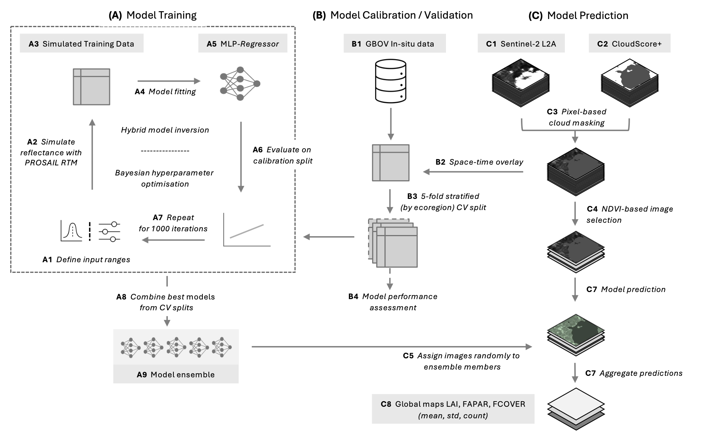

# Model Training

This repository contains scripts for training a machine learning model using Bayesian optimization with the Optuna framework. The model training follows an iterative optimization process based on the PROSAIL RTM hybrid inversion procedure.

**Workflow Overview**

1. Run `optunaTraining.py`
        - This script performs iterative Bayesian optimization of model hyperparameters.
        - It simulates reflectance (using `rtm_pipeline_python.classes.rtm_simulator`) data using PROSAIL and trains a Multi-Layer Perceptron (MLP) regression model.
        - The best-performing configurations are selected over 1000 iterations.
        - Make sure to change the storage location of the local SQL database used by `OPTUNA`: change field `optuna_storage` in `config/train_pipeline.yaml`

2. Run `finalTraining.py`
        - This script retrains the best models from the Optuna optimization process.
        - It saves the final models for later use in vegetation trait predictions.